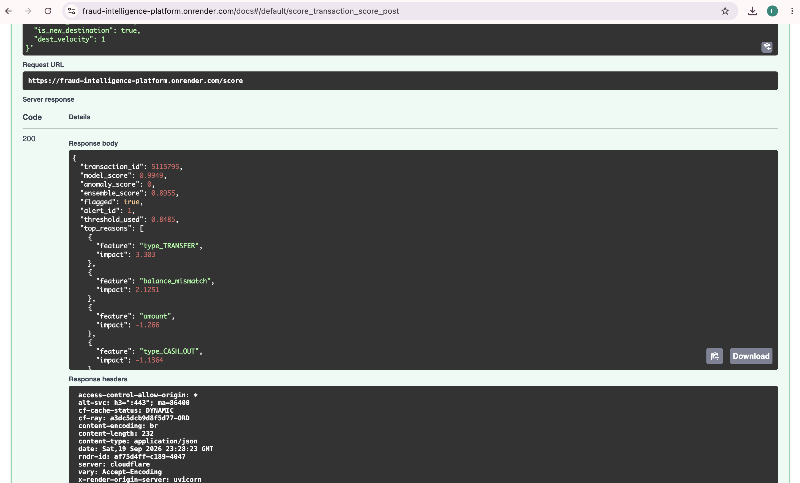
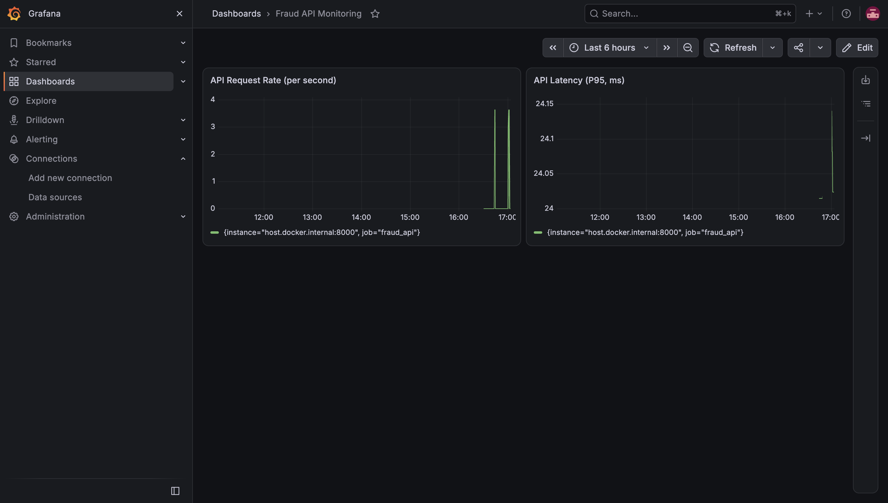
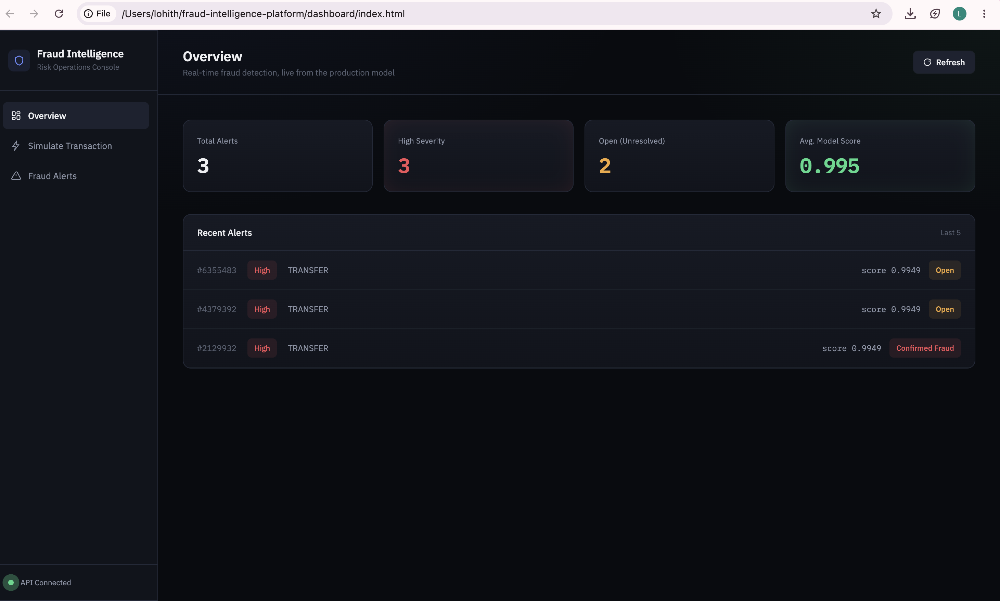

# Real-Time Adaptive Fraud Intelligence Platform

A production-style data engineering and machine learning system for detecting fraudulent financial transactions in real time — built end-to-end: streaming ingestion, feature engineering, a feature store, a trained fraud model with explainability, a live API, a working investigator dashboard, monitoring, CI/CD, and cloud deployment.

**Live demo:** [https://lohith0703.github.io/fraud-intelligence-platform/](https://lohith0703.github.io/fraud-intelligence-platform/)
**Live API:** [https://fraud-intelligence-platform.onrender.com](https://fraud-intelligence-platform.onrender.com) ([interactive docs](https://fraud-intelligence-platform.onrender.com/docs))

> Note: the live demo runs on a free-tier host and may take 30–60 seconds to wake up on the first request after a period of inactivity.

---

## What this is, and what it isn't

This project is a real, working system — not a notebook, not a mockup. Every number in this README was measured, not assumed. Every phase below includes at least one real bug or wrong hypothesis that was found and fixed, documented honestly in `docs/`.

**What's deployed live:** the scoring API (model + explainability + alerts), a Postgres database, and the dashboard.
**What runs locally only:** the streaming pipeline (Kafka, the feature store, batch feature computation) — this is a deliberate scope decision, not a limitation. Running Kafka and a feature store 24/7 in the cloud costs real money and isn't necessary to demonstrate the architecture; it's fully built and demoable locally via one Docker Compose command.

---

## Architecture

```
Transaction Producer → Kafka → Feature Engineering (Redis-backed) → Feast Feature Store
                                                                            ↓
                                                    XGBoost Model + Anomaly Detector + SHAP
                                                                            ↓
                                              FastAPI (ensemble score, alerts) → Dashboard
                                                                            ↓
                                                      Prometheus + Grafana (monitoring)
```

Postgres is the system of record throughout (raw transactions, engineered features, alerts). Redis serves two roles: real-time feature state for the streaming consumer, and Feast's online feature store.

---

## The dataset

[PaySim1](https://www.kaggle.com/datasets/ealaxi/paysim1) — 6,362,620 synthetic mobile-money transactions. Chosen because it's sequential/timestamped (streamable) and has account-to-account structure. It's synthetic, not real financial data — no real fraud dataset is ever publicly available, for obvious reasons — and that's stated here plainly rather than implied otherwise.

Measured fraud rate: **0.129%** (8,213 of 6,362,620 transactions). Fraud is concentrated entirely in `TRANSFER` and `CASH_OUT` transactions.

---

## Phase 1 — Data Foundation

- Explored the full dataset before writing any pipeline code; found that the balance columns leak the fraud label (PaySim rolls back detected-fraud transactions), so they're never used directly as model features
- Normalized Postgres schema (`accounts`, `transactions`, `fraud_labels`), loaded via a chunked bulk-insert script — all 6.3M rows, verified
- Kafka (KRaft mode, no Zookeeper) with a producer that replays historical transactions as a simulated live stream, independently verified by reading raw messages back out of the topic

Details: [`docs/01_data_exploration.md`](docs/01_data_exploration.md)

## Phase 2 — Feature Engineering & Streaming

- A stateful Kafka consumer computing 5 real-time behavioral features per transaction (velocity, destination velocity, amount deviation, balance consistency, destination novelty), backed by Redis so state survives restarts
- **Bug found and fixed:** the balance-consistency check assumed money always left an account; broke on `CASH_IN` transactions where money enters. Caught through manual verification, not assumed correct.
- A Feast feature store (Postgres offline store, Redis online store) so the same feature definitions serve both live inference and training — preventing training-serving skew

Details: [`docs/02_feature_engineering_notes.md`](docs/02_feature_engineering_notes.md), [`docs/03_feature_store_notes.md`](docs/03_feature_store_notes.md)

## Phase 3 — ML & Fraud Intelligence

**Model:** XGBoost, trained on a chronological 80/20 split (not random — a random split would leak future information into training). The test window has a **4.4x higher fraud rate** than train — a real, measured concept-drift finding, not simulated.

**Honest results at the default threshold:** Precision 0.087 / Recall 0.981 / PR-AUC 0.797.

There is no threshold that maximizes precision and recall simultaneously on data this imbalanced — that's a property of the problem, not a modeling failure. The full trade-off curve was measured and a deliberate operating point was chosen (~80% recall / ~56% precision) as a defensible balance between missed fraud and investigator alert load:

| Recall | Precision |
|---|---|
| 49.9% | 96.9% |
| 70.1% | 82.4% |
| **80.0%** | **55.8%** |
| 90.0% | 17.3% |
| 95.0% | 10.9% |

**Anomaly detection (Isolation Forest):** trained with no access to labels. Honest finding: it caught only 13 of 4,250 fraud cases (0.31%) — fraud in this dataset isn't a raw statistical outlier, it's contextual. Kept in the ensemble anyway, at low weight, as insurance against fraud patterns not present in current labels — a documented, deliberate trade-off, not a false claim of improvement.

**Graph intelligence:** two specific hypotheses were tested against real data — high-fan-in "mule" accounts, and TRANSFER→CASH_OUT chains through the same account — and both were **disproven** with a clear root cause (99.85% of accounts transact only once in this dataset, and high fan-in reflects legitimate payment agents). Scoped down honestly rather than forcing a technique the data doesn't support.

**Explainability (SHAP):** per-transaction explanations via `TreeExplainer`. Found that `balance_mismatch`, while genuinely predictive, is also a leading driver of false positives — a concrete, evidence-based lead for future refinement.

**Ensemble:** combines the model (weight 0.9) and anomaly detector (weight 0.1). Measured honestly against the model alone: the ensemble does **not** improve PR-AUC (0.784 vs 0.797) on currently-labeled fraud — stated plainly rather than dressed up.

Details: [`docs/04`](docs/04_model_training_notes.md)–[`08_ensemble_notes.md`](docs/08_ensemble_notes.md)

## Phase 4 — Productionization & Dashboard

- **FastAPI** service: `/score` (model + ensemble + SHAP), `/alerts` (list/filter), `PATCH /alerts/{id}` (investigator resolution workflow) — all containerized via Docker
- **Measured, not claimed, latency:** P50 1.75ms / P95 2.17ms / P99 2.61ms in initial testing; later measured at P95 ~14–24ms after adding real alert-persistence writes to Postgres — the honest cost of that added functionality, documented rather than hidden
- **Drift detection (PSI):** found that PSI on the raw features completely missed the known 4.4x fraud-rate shift (PSI measures feature drift, not label/concept drift) — and that standard PSI thresholds fail entirely on rare-event variables like fraud, a genuine limitation discovered through testing, not assumed
- **Monitoring:** Prometheus scraping real request count, flagged count, and latency histograms from the API; Grafana dashboards built and screenshotted as real evidence, not described
- **CI/CD:** GitHub Actions running the test suite against a real, ephemeral Postgres service container on every push, plus a Docker build verification step — first CI run failed for an honest, fixable reason (no database in the fresh environment), documented and resolved
- **Dashboard:** a working investigator console (not a mockup) — live KPIs, a transaction simulator with a real SHAP-backed risk gauge, and a full alert resolution workflow, all talking to the live production API

Details: [`docs/09_api_notes.md`](docs/09_api_notes.md)–[`docs/13_deployment_notes.md`](docs/13_deployment_notes.md)

**Live API, interactive docs, real response:**



**Dashboard preview:**




---

## Running it locally

Requires Docker Desktop and Python 3.13.

```bash
git clone https://github.com/lohith0703/fraud-intelligence-platform.git
cd fraud-intelligence-platform
python3 -m venv venv
source venv/bin/activate
pip install -r api/requirements.txt

docker compose up -d --build
```

This starts Postgres, Kafka, Redis, Prometheus, Grafana, and the API together. The local API is then available at `http://localhost:8001`; Grafana at `http://localhost:3000` (default login `admin`/`admin`).

To run the full streaming pipeline (producer → Kafka → feature engineering → Feast) and retrain the model from scratch, see the phase-by-phase scripts in `scripts/`, `streaming/`, and `ml/` — each documented in the corresponding `docs/` file.

Tests:
```bash
python3 -m pytest tests/ -v
```

---

## Tech stack, and why each piece is there

| Tool | Why |
|---|---|
| Kafka | Decouples ingestion from processing; a service being briefly down doesn't drop transactions |
| Postgres | Normalized relational storage; supports the account-relationship queries fraud detection needs |
| Redis | Sub-millisecond state for real-time features; also backs Feast's online store |
| Feast | One feature definition serving both training and live inference — prevents training-serving skew |
| XGBoost | Industry-standard for structured/tabular fraud data; native class-imbalance handling |
| SHAP | Per-transaction, mathematically grounded explanations — not just global feature importance |
| FastAPI | Async, typed, auto-documented — a real interface other systems (or the dashboard) can call |
| Prometheus + Grafana | Industry-standard monitoring; a system watching its own health, not manually re-checked |
| Docker Compose | The whole backend starts with one command, identically on any machine |
| GitHub Actions | Independent verification that the code works from a clean environment, not just "on my machine" |
| Render + GitHub Pages | Free, genuinely live hosting for the API/database and the static dashboard |

---

## Known limitations (stated honestly, not hidden)

- The dataset is synthetic; no real fraud dataset is publicly available for a project like this
- Streaming/Kafka/Feast are not deployed to the cloud — demoed locally by design, not by oversight
- The ensemble does not currently outperform the base model on measured metrics; retained for future/unlabeled-fraud coverage
- Free-tier hosting means the live API can take up to a minute to wake up after inactivity
- Full multi-hop money-laundering chain detection and device/IP-based ring detection were investigated and found unsupported by this specific dataset (no device/IP fields, and accounts transact too rarely) — documented as future work requiring a richer dataset, not implemented here

---

## Repository structure

```
producer/         Kafka transaction producer
streaming/         Kafka consumer + real-time feature engineering
feature_store/     Feast feature definitions and repo
ml/                Model training, anomaly detection, SHAP, ensemble scoring
api/               FastAPI service + Dockerfile
dashboard/         Investigator console (HTML/CSS/JS)
infra/             Prometheus config
scripts/           Data loading, batch feature computation, latency/drift measurement
docs/              Phase-by-phase findings, bugs, and decisions (the real story of this project)
tests/             pytest suite, run in CI against a real database
.github/workflows/ CI pipeline
```
